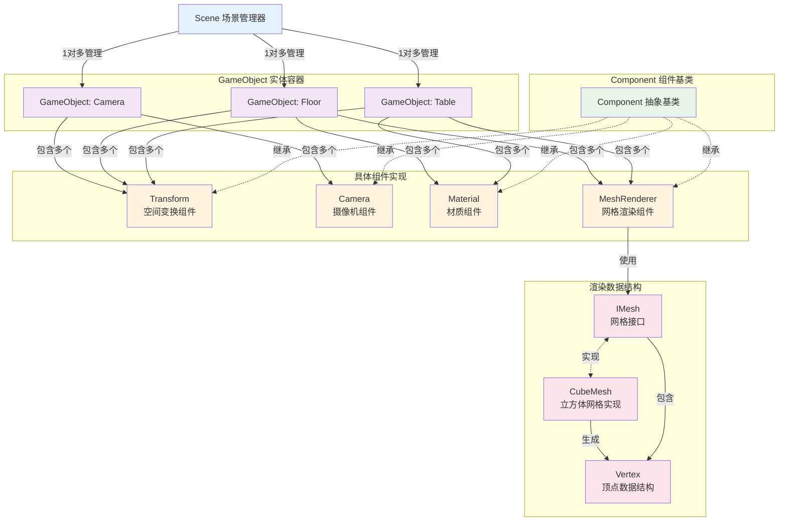

---
tags:
    - OpenXR
    - Tutorial
    - Engine
    - ECS
created: 2025-08-01
updated: 2025-08-01
---

在 [Ch 06 OpenXR Frame Submission Pipeline](Ch%2006%20OpenXR%20Frame%20Submission%20Pipeline.md) 中，我们已经实现了完整的帧提交管线，能够在 XR 设备中显示空白内容。本章中，我们将实现一个基于 ECS（Entity Component System）架构的 OpenXR Engine，通过组件化的设计来管理场景中的对象和渲染流程，最终实现一个包含桌子和地板的简单 3D 场景。

OpenXR Engine 的设计目标是为 OpenXR 应用提供一个轻量级、高效的渲染框架。其核心设计原则包括：

1. **与 OpenXR 深度集成**：Engine 的组件直接与 OpenXR 的 API 协作，避免不必要的抽象层，也方便理解，例如
    -  [Transform 组件](#transform%20组件) 直接使用 OpenXR 的坐标系统和数据类型
    -  [Camera 组件](#camera%20组件) 管理 OpenXR 的 Swapchain Images 和 RenderSettings
2. **组件化设计**：通过 ECS 架构实现功能的模块化，便于扩展和维护

Engine 采用简化的 ECS 架构：

-   **Entity（实体）**：由 `GameObject` 类表示，作为组件的容器
-   **Component（组件）**：继承自 `Component` 基类，实现具体功能
-   **System（系统）**：通过组件的生命周期方法（PreTick、Tick、PostTick）隐式实现

> [!note]
>
> 本章的目标是构建一个与 OpenXR 紧密集成的轻量级渲染引擎，重点关注组件如何与 OpenXR 的渲染管线协作，而不是一个通用的 ECS 引擎实现。

Engine 的文件结构如下所示：

```
Engine/
├── Core/
│   ├── GameObject.h/.cpp          # ECS 中的实体基类
│   ├── Component.h/.cpp           # 组件基类
│   └── Scene.h/.cpp               # 场景管理器
├── Components/
│   ├── Core/
│   │   └── Transform.h/.cpp       # 变换组件
│   └── Rendering/
│       ├── Camera.h/.cpp          # 摄像机组件
│       ├── Material.h/.cpp        # 材质组件
│       └── MeshRenderer.h/.cpp    # 网格渲染器组件
└── Rendering/
    ├── Vertex.h                   # 顶点数据结构
    └── Mesh/
        ├── IMesh.h                # 网格接口
        └── CubeMesh.h/.cpp        # 立方体网格实现
```

Engine 的核心架构关系如下图所示：



## Engine 架构与 ECS 实现

### GameObject 基类设计

`GameObject` 是 Engine 中的核心类，提供组件管理功能：

```cpp
class GameObject
{
public:
    GameObject(const std::string& name = "GameObject");

    template<typename T, typename... Args>
    T* AddComponent(Args&&... args);

    template<typename T>
    T* GetComponent();

    void PreTick(float deltaTime);
    void Tick(float deltaTime);
    void PostTick(float deltaTime);

private:
    std::string m_name;
    std::vector<std::unique_ptr<Component>> m_components;
};
```

### Component 基类设计

`Component` 基类定义了组件的生命周期接口：

```cpp
class Component
{
public:
    Component() = default;
    virtual ~Component() = default;

    virtual void Initialize() {}
    virtual void PreTick(float deltaTime) {}
    virtual void Tick(float deltaTime) {}
    virtual void PostTick(float deltaTime) {}
    virtual void Destroy() {}

    GameObject* GetGameObject() const { return m_gameObject; }

private:
    GameObject* m_gameObject = nullptr;
    friend class GameObject;
};
```

#### 组件生命周期管理

组件的生命周期与 OpenXR 的渲染循环紧密配合：

-   **PreTick**：在 OpenXR WaitFrame 后执行，用于准备渲染数据
-   **Tick**：在 OpenXR BeginFrame 和 EndFrame 之间执行，执行实际渲染
-   **PostTick**：在 OpenXR EndFrame 后执行，用于清理和状态更新

这种设计确保了组件的执行时机与 OpenXR 的帧同步要求一致。

## 核心组件详解

### Transform 组件

Transform 组件负责管理 GameObject 的空间变换信息，直接使用 OpenXR 的数据类型：


```cpp
class Transform : public Component
{
public:
    Transform(const XrVector3f& position = {0.0f, 0.0f, 0.0f},
              const XrQuaternionf& rotation = {0.0f, 0.0f, 0.0f, 1.0f},
              const XrVector3f& scale = {1.0f, 1.0f, 1.0f});

    const XrMatrix4x4f& GetModelMatrix() const { return m_modelMatrix; }

private:
    XrVector3f m_position;
    XrQuaternionf m_rotation;
    XrVector3f m_scale;
    XrMatrix4x4f m_modelMatrix;

    void UpdateModelMatrix();
};
```


### Camera 组件

Camera 组件作为 OpenXR 视图系统与 Engine 的桥梁，管理渲染相关的配置：

```cpp
class Camera : public Component
{
public:
    struct RenderSettings
    {
        uint32_t width;
        uint32_t height;
        void* colorImage;
        void* depthImage;
        XrEnvironmentBlendMode blendMode;
        XrVector4f clearColor;
    };

    void SetRenderSettings(const RenderSettings& settings);
    const RenderSettings& GetRenderSettings() const { return m_renderSettings; }

    const XrMatrix4x4f& GetViewMatrix() const;
    const XrMatrix4x4f& GetProjectionMatrix() const;

private:
    RenderSettings m_renderSettings;
};
```

Camera 组件负责：

-   管理渲染目标（colorImage、depthImage）
-   提供视图和投影矩阵
-   配置渲染参数（分辨率、混合模式等）

其生命周期与 Scene 中的 Active Camera 概念关联，通过 `Scene::GetActiveCamera()` 获取当前活跃的摄像机。

#### RenderSettings 数据结构详解

RenderSettings 包含了渲染一帧所需的所有配置：

-   `width/height`：渲染目标的分辨率
-   `colorImage/depthImage`：来自 OpenXR Swapchain 的图像
-   `blendMode`：OpenXR 环境混合模式
-   `clearColor`：背景清除颜色

#### 与 OpenXR 视图系统的集成

Camera 组件通过以下方式与 OpenXR 集成：

-   渲染目标直接使用 OpenXR Swapchain Images
-   视图矩阵和投影矩阵来自 OpenXR 的 `xrLocateViews` 调用
-   环境混合模式直接对应 OpenXR 的 `XrEnvironmentBlendMode`

### Material 组件

Material 组件负责管理着色器和渲染管线：

```cpp
class Material : public Component
{
public:
    Material(const std::string& vertexShaderPath,
             const std::string& fragmentShaderPath,
             GraphicsAPI::API api);

    void* GetOrCreatePipeline();
    void SetColor(const XrVector4f& color) { m_color = color; }
    const XrVector4f& GetColor() const { return m_color; }

private:
    std::string m_vertexShaderPath;
    std::string m_fragmentShaderPath;
    XrVector4f m_color = {1.0f, 1.0f, 1.0f, 1.0f};
    void* m_pipeline = nullptr;
};
```

#### Material 组件的设计理念

Material 组件封装了渲染状态和着色器程序，提供简化的接口来配置渲染外观。

#### Shader 管理和编译流程

着色器的编译和管理通过 `GraphicsAPI` 层进行，支持预编译的 SPIR-V 着色器文件。

#### Pipeline 创建和缓存机制

Pipeline 对象在首次使用时创建并缓存，避免重复创建造成的性能开销。通过 `GetOrCreatePipeline()` 实现延迟初始化。

### Mesh Renderer 组件

MeshRenderer 是 Engine 中的核心渲染组件，整合各个组件的数据进行实际渲染：

```cpp
class MeshRenderer : public Component
{
public:
    void SetMesh(std::shared_ptr<IMesh> mesh);

    void Initialize() override;
    void Tick(float deltaTime) override;
    void Destroy() override;

private:
    std::shared_ptr<IMesh> m_mesh;
    void* m_vertexBuffer = nullptr;
    void* m_indexBuffer = nullptr;
    void* m_uniformBuffer = nullptr;
    bool m_buffersCreated = false;

    void CreateBuffers();
    void RenderMesh();
    void DestroyBuffers();
};
```

#### MeshRenderer 的渲染流程

MeshRenderer 的渲染流程包括：

1. **缓冲区创建**：在 `Initialize()` 中创建顶点和索引缓冲区
2. **渲染执行**：在 `Tick()` 中调用 `RenderMesh()` 执行实际渲染
3. **资源清理**：在 `Destroy()` 中清理 GPU 资源

#### 缓冲区管理（顶点、索引、uniform）

MeshRenderer 管理三种类型的缓冲区：

-   **顶点缓冲区**：存储网格的顶点数据（位置+法线）
-   **索引缓冲区**：存储三角形索引数据
-   **Uniform 缓冲区**：存储渲染时的变换矩阵和材质参数

#### 与 OpenXR 渲染循环的集成

`RenderMesh()` 方法展示了与 OpenXR 的完整集成流程：

```cpp
void MeshRenderer::RenderMesh()
{
    // 获取必需的组件
    Transform* transform = GetGameObject()->GetComponent<Transform>();
    Material* material = GetGameObject()->GetComponent<Material>();
    Camera* activeCamera = Scene::GetActiveCamera();

    // 获取 OpenXR 渲染设置
    const Camera::RenderSettings& cameraSettings = activeCamera->GetRenderSettings();

    // 设置 OpenXR 渲染目标
    void* colorImages[] = {cameraSettings.colorImage};
    OpenXRCoreMgr::openxrGraphicsAPI->graphicsAPI->SetRenderAttachments(
        colorImages, 1, cameraSettings.depthImage,
        cameraSettings.width, cameraSettings.height,
        material->GetOrCreatePipeline());

    // 构建渲染数据
    struct ObjectRenderData {
        XrMatrix4x4f viewProj;
        XrMatrix4x4f modelViewProj;
        XrMatrix4x4f model;
        XrVector4f color;
    };

    ObjectRenderData renderData;
    const XrMatrix4x4f& modelMatrix = transform->GetModelMatrix();
    const XrMatrix4x4f& viewMatrix = activeCamera->GetViewMatrix();
    const XrMatrix4x4f& projectionMatrix = activeCamera->GetProjectionMatrix();

    XrMatrix4x4f_Multiply(&renderData.viewProj, &projectionMatrix, &viewMatrix);
    renderData.model = modelMatrix;
    XrMatrix4x4f_Multiply(&renderData.modelViewProj, &renderData.viewProj, &renderData.model);
    renderData.color = material->GetColor();

    // 执行渲染命令
    OpenXRCoreMgr::openxrGraphicsAPI->graphicsAPI->DrawIndexed(indexCount);
}
```

这个流程展示了 Engine 组件如何与 OpenXR 的渲染管线无缝协作。

#### Mesh 接口和实现

IMesh 接口定义了网格数据的访问方式：

```cpp
class IMesh
{
public:
    virtual ~IMesh() = default;
    virtual const std::vector<Vertex>& GetVerticesWithNormals() const = 0;
    virtual const std::vector<uint32_t>& GetIndices() const = 0;
    virtual uint32_t GetIndexCount() const = 0;
};
```

CubeMesh 提供了立方体网格的具体实现，通过 `GenerateCubeData()` 函数生成包含位置和法线信息的顶点数据。

#### Vertex 数据结构

Vertex 结构统一了位置和法线数据：

```cpp
struct Vertex
{
    XrVector4f position;  // 使用 w=1.0 表示位置
    XrVector3f normal;    // 法线向量

    Vertex() : position{0.0f, 0.0f, 0.0f, 1.0f}, normal{0.0f, 0.0f, 0.0f} {}
    Vertex(const XrVector4f& pos, const XrVector3f& norm) : position(pos), normal(norm) {}
};
```

这种统一的设计简化了渲染管线，避免了多个顶点属性缓冲区的管理复杂性。

## TableFloorScene 实践应用

通过 TableFloorScene 的完整代码演示，我们可以看到如何使用 Engine 组件构建实际场景。整个场景的创建过程体现了组件化设计的优势和与 OpenXR 的集成效果。

TableFloorScene 的核心实现在 `CreateSceneObjects()` 方法中，展示了标准的场景构建流程：

```cpp
void TableFloorScene::CreateSceneObjects()
{
    // 创建共享的立方体网格
    auto cubeMesh = std::make_shared<CubeMesh>(1.0f);

    // 创建摄像机对象
    GameObject* cameraObject = m_scene->CreateGameObject("Camera");
    Camera* camera = cameraObject->AddComponent<Camera>();

    Camera::RenderSettings settings;
    settings.width = 1024;
    settings.height = 1024;
    settings.colorImage = nullptr;  // 将在运行时由 OpenXR 提供
    settings.depthImage = nullptr;  // 将在运行时由 OpenXR 提供
    settings.blendMode = XR_ENVIRONMENT_BLEND_MODE_OPAQUE;
    settings.clearColor = {0.0f, 0.0f, 0.2f, 1.0f};  // 深蓝色背景
    camera->SetRenderSettings(settings);

    // 创建地板对象
    GameObject* floorObject = m_scene->CreateGameObject("Floor");
    Transform* floorTransform = floorObject->AddComponent<Transform>(
        XrVector3f{0.0f, -m_viewHeightM, -1.0f},        // 位置：用户脚下1米远
        XrQuaternionf{0.0f, 0.0f, 0.0f, 1.0f},          // 旋转：无旋转
        XrVector3f{2.0f, 0.1f, 2.0f}                     // 缩放：2x2米的薄板
    );
    MeshRenderer* floorRenderer = floorObject->AddComponent<MeshRenderer>();
    floorRenderer->SetMesh(cubeMesh);  // 复用立方体网格
    Material* floorMaterial = floorObject->AddComponent<Material>("VertexShader.spv", "PixelShader.spv", VULKAN);
    floorMaterial->SetColor({0.4f, 0.5f, 0.5f, 1.0f});  // 灰绿色
    floorMaterial->Initialize();

    // 创建桌子对象
    GameObject* tableObject = m_scene->CreateGameObject("Table");
    Transform* tableTransform = tableObject->AddComponent<Transform>(
        XrVector3f{0.0f, -m_viewHeightM + 0.9f, -0.7f}, // 位置：地板上方0.9米
        XrQuaternionf{0.0f, 0.0f, 0.0f, 1.0f},          // 旋转：无旋转
        XrVector3f{1.0f, 0.2f, 1.0f}                     // 缩放：1x1米的桌面
    );
    MeshRenderer* tableRenderer = tableObject->AddComponent<MeshRenderer>();
    tableRenderer->SetMesh(cubeMesh);  // 复用同一个网格
    Material* tableMaterial = tableObject->AddComponent<Material>("VertexShader.spv", "PixelShader.spv", VULKAN);
    tableMaterial->SetColor({0.6f, 0.6f, 0.4f, 1.0f});  // 浅棕色
    tableMaterial->Initialize();
}
```

这个实现展示了以下关键特点：

**Scene 类的基本使用**：通过 `m_scene->CreateGameObject()` 创建游戏对象，Scene 负责管理所有对象的生命周期。

**创建 Camera GameObject 和配置 RenderSettings**：Camera 组件的 RenderSettings 中的 `colorImage` 和 `depthImage` 在创建时设为 nullptr，这些将在运行时由 OpenXR Swapchain 提供具体的图像。`blendMode` 设置为 `XR_ENVIRONMENT_BLEND_MODE_OPAQUE` 表示完全遮挡现实环境。

**创建 Floor GameObject**：Transform 设置和 Material 配置展示了如何使用 OpenXR 坐标系。地板位置的 Y 坐标为 `-m_viewHeightM`（默认 -1.5 米），表示在用户脚下。缩放为 `{2.0f, 0.1f, 2.0f}` 创建了一个 2 米 ×2 米 ×10 厘米的薄板。

**创建 Table GameObject**：位置调整和颜色差异化展示了组件的复用能力。桌子的 Y 坐标为 `-m_viewHeightM + 0.9f`，即地板上方 90 厘米处，符合真实桌子的高度。

**共享 Mesh 资源的使用模式**：`auto cubeMesh = std::make_shared<CubeMesh>(1.0f)` 创建的网格被 Floor 和 Table 两个对象共享，通过不同的 Transform 缩放实现不同的形状，这种设计避免了重复的内存占用。

**整体渲染效果和调试要点**：场景中的对象将在 Scene 的 `Update()` 方法中通过组件的生命周期进行渲染。每个 GameObject 的 Tick 方法会调用 MeshRenderer 的渲染逻辑，最终通过 OpenXR 的帧提交管线显示在 XR 设备中。

这个简单而完整的示例展示了 OpenXR Engine 如何通过组件化设计实现高效的场景构建和渲染，为更复杂的 XR 应用奠定了基础。
